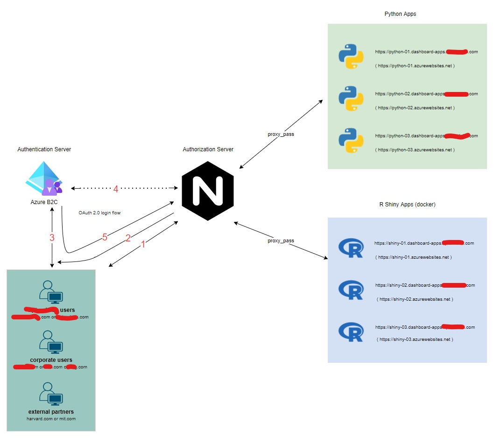

# AzureB2C_NGINX_PHP
AzureB2C is one of my favorite cloud services offered by Microsoft Azure. Although Microsoft has done a great job on their documentation, they didn't include PHP on their application code samples. So to all of my fellow PHP lovers out there, here is my implementation of a robust Customer Identity Access Management (CIAM) solution using Nginx, PHP, and AzureB2C tech stack.

## Requirements
- understanding of [AzureB2C](https://docs.microsoft.com/en-us/azure/active-directory-b2c/overview)
- working knowledge in HTTP and HTTP status codes.
- working knowledge in Nginx as reverse proxy and Nginx's [Auth Request Modue](http://nginx.org/en/docs/http/ngx_http_auth_request_module.html)
- working knowledge in [JWT](https://jwt.io/introduction)
- working knowledge in OpenID Connect (OIDC) and Oauth2.

## Documentation
 

