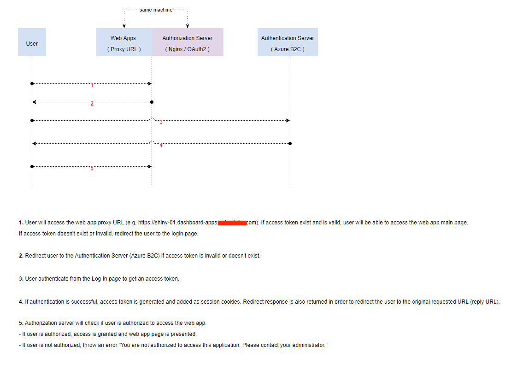

# AzureB2C_NGINX_PHP
AzureB2C is one of my favorite cloud services offered by Microsoft Azure. Although Microsoft has done a great job on Azure B2C documentation, they didn't include PHP on their application code samples and use cases. So for my fellow PHP lovers out there, here is my implementation of a robust Customer Identity Access Management (CIAM) solution using Nginx, PHP, and AzureB2C tech stack.

## Problem
- Python web apps and Shiny apps created by our data scientists do not include user authentication (IAM) features. It can be a problem when you don't want to expose your apps to the public and you don't want search engines like google or bing to include your web apps on their web indexing.

## Solution
- One quick and dirty solution is to place your web apps behind a reverse proxy server (Nginx) and enable HTTP Basic Auth. The problem with this implementation is that all of the user account management tasks like creating user, password reset, password expiration and account deactivation will all be done manually by the System administrator. **Azure B2C** come to the rescue. It supports Local accounts and Social Identity Provider accounts like Facebook, LinkedIn or Twitter. It also supports features like User Flow wherein user can get invitation to Sign-up and or Sign-in. And one of the most important feature is the support for MFA (Multi-Factor Authentication).

## Requirements
- understanding of [AzureB2C](https://docs.microsoft.com/en-us/azure/active-directory-b2c/overview)
- working knowledge in HTTP and HTTP status codes.
- working knowledge in Nginx as reverse proxy and Nginx's [Auth Request Modue](http://nginx.org/en/docs/http/ngx_http_auth_request_module.html)
- working knowledge in [JWT](https://jwt.io/introduction)
- working knowledge in OpenID Connect (OIDC) and Oauth2.

## Documentation

 
 

### User Authentication Flow
 
 

